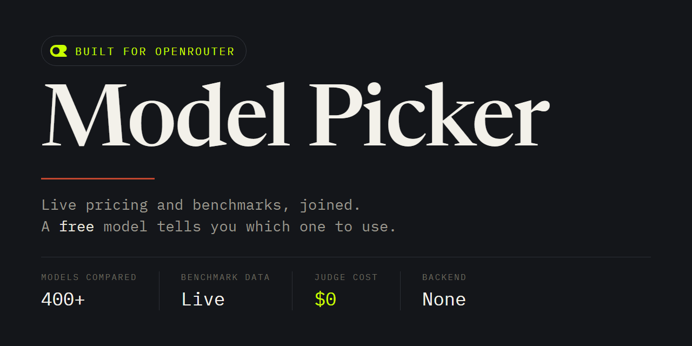

<h1 align="center">openrouter-model-picker</h1>

  <strong>Tell it a task, a price ceiling, and a quality bar. It pulls live OpenRouter pricing and benchmark data, then asks a free model to recommend one and explain why.</strong> 
  No backend. No dependencies. The recommendation call is always free.

  
  
  
  

---

## What it does

OpenRouter's own `/models` endpoint gives you live pricing for around 400 models. Its `/benchmarks` endpoint gives you live quality data for a large chunk of them: Artificial Analysis's intelligence, coding, and agentic indices, plus OpenRouter's own GPQA-Diamond, tau-bench-airline, and web-search evals. Almost nobody outside OpenRouter's own site puts those two together, so picking a model still means opening several tabs and eyeballing it.

This tool asks you three things: what the task is, what you're willing to pay, and whether you're optimizing for quality, price, or the balance of the two. It pulls both endpoints, joins them, and shows you a sortable, filterable table. Then it hands the filtered shortlist to a free OpenRouter model and asks it to write up a real recommendation in plain language: which model, why it beats the runner-up for *this* task, and what you'd be trading away.

Because the judge call always targets a model whose id ends in `:free`, getting that recommendation costs nothing, no matter what you end up picking for the actual job.

## How it works

1. **`GET /api/v1/models`**: the full model list, with pricing, context length, input/output modalities, and supported parameters.
2. **`GET /api/v1/benchmarks?source=artificial-analysis`** and **`GET /api/v1/benchmarks?source=openrouter`**: two calls cover every benchmark this app uses, since each source returns every metric it tracks in one shot, with no per-task-type refetching.
3. Everything is joined client-side on `canonical_slug` / `model_permaslug`, filtered by your task's modality needs and your price ceiling, and sorted by whichever of best-quality / balanced / cheapest you picked. **A model with no benchmark coverage is shown as "n/a", never as a zero**, because unmeasured and measured-and-bad are different facts, and this app does not collapse them into one.
4. The top 15 candidates, your task description, and your preferences go to a free model as a chat completion. If that model is rate-limited or (a real thing you'll hit) restricts itself to "agentic harness" callers only, the app automatically tries the next free model, ranked by reasoning support and context length, until one answers or the free roster is exhausted.
5. The response is rendered as-is: prose, not a parsed score.

Steps 1-3 run entirely in your browser against `openrouter.ai`. There is no server anywhere in this project; CORS on OpenRouter's API is wide open, which is what makes that possible, and it's also why the key you enter is never seen by anything this project runs. See [SECURITY.md](SECURITY.md).

## Using it

Open `index.html` in a browser (a static file server works fine; `python -m http.server` or the published GitHub Pages site both do), paste an [OpenRouter API key](https://openrouter.ai/settings/keys), pick a task preset (or write your own), and click **Find models**. The price ceiling defaults to $0/M in both directions (free models only), and every field is editable.

### Task presets

Coding, Code Review, General Chat / Assistant, Reasoning / Math, Agentic / Tool Use, Web Search / Research, OCR / Document Extraction, Image Understanding (Vision), Image Generation, Text-to-Speech / Audio, Translation, Summarization, or a custom task description.

## Design notes worth knowing before you trust this

**Why not just call `model: "openrouter/free"`?** That's OpenRouter's own router across every free-tier model, and the obvious thing to reach for. Tested live: it routed a plain question to `nvidia/nemotron-3.5-content-safety:free`, a content-safety classifier, which answered with a safety label instead of the actual question. It routes across *all* free models, including narrow specialists, rather than picking the best free model for this specific prompt. This app ranks free models by reasoning support and context length instead, and falls back through that ranked list on error, a choice made after seeing that result, not a guess.

**Why does the fallback ladder retry on a 403?** A free model can reject a request with 403 because that specific model restricts itself to "agentic harness" callers (observed live from `thinkingmachines/inkling-small:free`), which is a per-model policy, not a broken key. Only a 401 (an actually bad key) stops the ladder; everything else advances to the next free model. See `isRetryableJudgeStatus` in `lib/match.js`.

**What happens if I click Find models twice, or hit Stop?** Only one search runs at a time. Starting a new search supersedes the previous one, so a slower earlier search cannot render its table or verdict over a newer one. **Stop** ends the running search and prevents any later table, verdict, or status write from that run, even if its requests complete anyway. (`tests/app-cancellation.test.mjs` covers this by driving the real `app.js` in a headless DOM.)

**Why do a few models show a price of "?"** OpenRouter's own meta-routers (`openrouter/auto`, `openrouter/fusion`, and similar) report a price of `"-1"`, meaning "depends on whichever model actually gets picked." This app treats a negative price as unknown, not as a real (and nonsensical) negative dollar figure, and unknown prices are excluded from any price-ceiling search the same way a missing price would be.

## Contributing, security

See [CONTRIBUTING.md](CONTRIBUTING.md) and [SECURITY.md](SECURITY.md).

## License

MIT. See [LICENSE](LICENSE).
